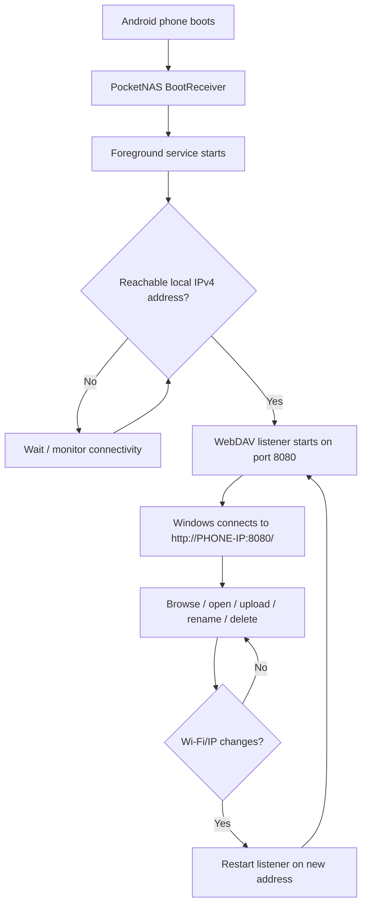

# PocketNAS

> Turn an Android phone into a lightweight WebDAV Wi‑Fi drive that Windows File Explorer can browse and modify over the local network.


PocketNAS is a small native Android file server designed for a simple use case: keep a phone and a Windows PC on the same network, start PocketNAS, and access the phone's shared storage from **Windows File Explorer** using WebDAV.

The current public code line is **v2.3**. It is intentionally lightweight: the UI and WebDAV engine are implemented mostly in native C, while a very small generated DEX layer provides the Android foreground service and boot receiver.

> [!IMPORTANT]
> **Project status: beta.** PocketNAS v2.3 has been tested on the development device and Windows WebDAV workflows, but it has not yet received broad device/vendor testing. Read the [Security model](#security-model--important-warnings) and [Known limitations](#known-limitations) before using it with important data.

## What PocketNAS can do

- Expose Android shared storage through WebDAV on TCP port **8080**.
- Connect from Windows using a URL such as `http://192.168.1.20:8080/`.
- Browse directories and open/download files.
- Upload and overwrite files.
- Create directories.
- Rename and move files/directories.
- Copy files/directories.
- Delete files/directories.
- Use a **read-only** mode when write access is not wanted.
- Run with **authentication disabled** for fast trusted-LAN setup.
- Optionally save a **permanent 4–16 digit password** and enable HTTP Digest authentication.
- Continue running through an Android **foreground service** after the UI is closed.
- Start the background service after **device boot** and after package replacement/update.
- Monitor network-address changes and restart the WebDAV listener when connectivity returns.
- Display request count, transfer volume, current LAN address, authentication state and storage state in the app.
- Detect whether shared storage is actually writable/deletable instead of treating directory listing as full permission.
- Return useful MIME types for common file formats.
- Support HTTP byte-range reads for media, previews and large-file clients.

## Quick start

### Requirements

**Phone**

- Android 9 or newer (`minSdkVersion 28`).
- ARM64 / `arm64-v8a` device.
- Wi‑Fi or another reachable local IPv4 network shared with the PC.
- Android **All files access** permission for full shared-storage read/write/delete. Without it, listing may work while writes/deletes fail.

**Windows PC**

- Windows 10 or Windows 11.
- The PC must be able to reach the phone's IP address and TCP port `8080`.
- Windows **WebClient** service may need to be enabled for File Explorer WebDAV network locations.

### 1. Install the APK

Download the APK from the repository's **Releases** page and install it on the Android phone.

For ADB installation:

```powershell
adb install PocketNAS-v2.3-arm64.apk
```

For an update signed with the same release key:

```powershell
adb install -r PocketNAS-v2.3-arm64.apk
```

### 2. Grant storage access

On first launch, PocketNAS reports either:

```text
STORAGE: FULL READ/WRITE
```

or:

```text
STORAGE: LIMITED - ENABLE ALL FILES ACCESS
```

or:

```text
STORAGE: PERMISSION REQUIRED
```

If permission is required, use the Android system path shown in the app:

```text
Settings
→ Special app access
→ All files access
→ PocketNAS
→ Allow
```

Return to PocketNAS afterward.

> Android vendors rename these screens. On Realme/ColorOS, search Settings for **All files access**, **Manage all files**, or **Special app access** if the exact path differs.

### 3. Note the Windows address

PocketNAS displays an address similar to:

```text
http://192.168.1.20:8080/
```

The phone and PC must be on a network where that address is reachable.

### 4. Add PocketNAS to Windows File Explorer

In Windows 11:

1. Open **File Explorer**.
2. Open **This PC**.
3. Right-click an empty area or use the toolbar menu.
4. Choose **Add a network location**.
5. Choose **Choose a custom network location**.
6. Enter the URL shown by PocketNAS, for example:

   ```text
   http://192.168.1.20:8080/
   ```

7. Complete the wizard and give the location a friendly name such as **PocketNAS Phone**.

If PocketNAS authentication is **OFF**, Windows should not require a PocketNAS username/password.

If authentication is **ON**, use:

```text
Username: pocketnas
Password: <the permanent password set in PocketNAS>
```

## Typical user workflow



The foreground service and boot receiver are designed so the server can remain available without keeping the main PocketNAS screen open.

## Controls in the Android app

### START SERVER / STOP SERVER

Starts or stops the WebDAV listener. The listener uses TCP port `8080`.

### READ ONLY

When read-only mode is enabled, PocketNAS rejects write-changing operations such as:

- `PUT`
- `MKCOL`
- `DELETE`
- `MOVE`
- `COPY`

Read operations such as `GET`, `HEAD` and `PROPFIND` remain available.

### SET PERMANENT PASSWORD

Opens the built-in numeric password editor. The current implementation accepts **4–16 digits**.

The password and settings are stored in the application's private configuration file and survive normal reboots and updates signed as the same app. Uninstalling the application or clearing app data removes the configuration.

### AUTHENTICATION

Authentication is **OFF by default**.

To enable it:

1. Tap **SET PERMANENT PASSWORD**.
2. Save a 4–16 digit password.
3. Tap **AUTHENTICATION: OFF**.
4. Confirm that the screen now shows **AUTHENTICATION: ON**.
5. Use username `pocketnas` from Windows.

PocketNAS uses HTTP Digest authentication with realm `PocketNAS`.

## WebDAV support

PocketNAS implements the following methods used by common Windows WebDAV workflows:

| Method | Purpose | v2.3 |
|---|---|---:|
| `OPTIONS` | Capability discovery | ✅ |
| `PROPFIND` | Directory/resource metadata | ✅ |
| `GET` | Download/open a file | ✅ |
| `HEAD` | File metadata without body | ✅ |
| `PUT` | Upload/overwrite a file | ✅ |
| `DELETE` | Delete a file or directory | ✅ |
| `MKCOL` | Create a directory | ✅ |
| `MOVE` | Rename/move | ✅ |
| `COPY` | Copy resource trees | ✅ |
| `PROPPATCH` | WebDAV property response compatibility | Basic |
| `LOCK` | WebDAV client compatibility | Basic |
| `UNLOCK` | WebDAV client compatibility | Basic |

PocketNAS is a **pragmatic Windows-oriented WebDAV implementation**, not a claim of complete RFC 4918 conformance. Applications that rely on advanced property, locking, quota or transactional semantics may behave differently from Windows File Explorer.

## Architecture

PocketNAS v2.3 deliberately avoids a large application framework.

```text
┌─────────────────────────────────────────────────────┐
│ Android                                             │
│                                                     │
│  android.app.NativeActivity                         │
│            │                                        │
│            ▼                                        │
│  libpocketnas.so                                    │
│  ├─ native UI                                       │
│  ├─ storage/path mapping                            │
│  ├─ WebDAV HTTP parser/server                       │
│  ├─ Digest authentication                           │
│  ├─ settings persistence                            │
│  └─ network monitor                                 │
│            │                                        │
│            ├──── TCP 8080 ──── Windows WebDAV       │
│            │                                        │
│            ▼                                        │
│  PocketNasService (small generated DEX class)       │
│  └─ foreground notification / START_STICKY          │
│                                                     │
│  BootReceiver (small generated DEX class)           │
│  └─ BOOT_COMPLETED / MY_PACKAGE_REPLACED            │
└─────────────────────────────────────────────────────┘
```

The APK contains only three principal runtime payloads:

```text
AndroidManifest.xml
classes.dex
lib/arm64-v8a/libpocketnas.so
```

See [docs/ARCHITECTURE.md](docs/ARCHITECTURE.md) for implementation details. For Android storage behavior, read [docs/ANDROID_STORAGE.md](docs/ANDROID_STORAGE.md). For file/MIME/range support, read [docs/FILE_COMPATIBILITY.md](docs/FILE_COMPATIBILITY.md).

## Source tree

```text
PocketNAS/
├── pocketnas.c                  # Native UI + WebDAV server + settings + networking
├── tools/
│   ├── make_manifest.py         # Generates binary AndroidManifest.xml for v2.3
│   ├── make_dex.py              # Generates tiny DEX service/receiver layer
│   ├── package_apk.py           # Creates unsigned APK ZIP container
│   ├── verify_release.py        # ZIP/ELF release sanity checks
│   └── reference_sign_apk_v2.py # Historical/reference APK v2 signer
├── scripts/
│   ├── build-linux.sh
│   └── build-windows.ps1
├── docs/
│   ├── ARCHITECTURE.md
│   ├── BUILDING.md
│   ├── WINDOWS_SETUP.md
│   ├── TROUBLESHOOTING.md
│   └── RELEASE_CHECKLIST.md
├── .github/
│   ├── workflows/
│   └── ISSUE_TEMPLATE/
├── CHANGELOG.md
├── CONTRIBUTING.md
├── SECURITY.md
├── LICENSE
└── README.md
```

## Build from source

The project does **not** currently use Gradle. The release pipeline is intentionally small:

1. Compile `pocketnas.c` for `arm64-v8a` using the Android NDK.
2. Generate the binary Android manifest.
3. Generate the small `classes.dex` service/receiver layer.
4. Package the three APK payloads.
5. Sign the APK using a permanent release key.
6. Verify the APK and test it on a real phone.

The ARM64 build must include:

```text
-mno-outline-atomics
```

This matters because an earlier experimental build referenced AArch64 outlined-atomic helper symbols that were not available on the tested Android runtime.

See **[docs/BUILDING.md](docs/BUILDING.md)** for Windows, Linux and signing instructions.

## Release signing — read before publishing

> [!CAUTION]
> **Do not publish a production release using a temporary, generated or lost signing key.** Android updates must be signed by the same identity as the installed release.

For the first public GitHub release:

1. Generate a dedicated release keystore on a trusted computer.
2. Back it up offline in at least two secure locations.
3. Never commit the keystore, private key or passwords to Git.
4. Sign every future update with the same release identity.
5. Store GitHub Actions signing material only as encrypted repository/environment secrets if automated release signing is used.

The experimental APKs produced during development should **not** define the long-term public signing identity unless the corresponding private key is securely under the maintainer's control.

## Security model & important warnings

PocketNAS is designed for **trusted local networks**, not exposure to the public Internet.

### Authentication is off by default

This is a convenience-first behavior requested for v2.3. If authentication is off, another device that can reach the PocketNAS port may be able to browse and modify shared files.

Because the service can start after boot, users who keep this feature enabled should strongly consider setting a permanent password and enabling authentication before using PocketNAS regularly.

### HTTP is not encrypted

PocketNAS currently serves:

```text
http://PHONE-IP:8080/
```

not HTTPS. File contents and WebDAV metadata are not protected by TLS. Digest authentication avoids transmitting the raw password as Basic authentication would, but it does **not** encrypt transferred files or all request metadata.

Do not use PocketNAS over untrusted/public Wi‑Fi for sensitive data.

### Digest authentication uses MD5

The v2.3 compatibility implementation uses HTTP Digest with `algorithm=MD5`. This is retained for Windows/client compatibility and should be considered a legacy authentication mechanism, not modern end-to-end transport security.

### Password storage

The configured password is stored in the application's private `pocketnas.conf` file with app-private filesystem permissions. It is not currently stored in Android Keystore and is not encrypted at rest by PocketNAS itself. Android's own application sandbox/device encryption provides the surrounding protection.

### Broad storage permission

To expose the shared-storage root, the current build requests Android's `MANAGE_EXTERNAL_STORAGE` / “All files access” capability. This is a powerful permission. Only install APKs from a release you trust and can verify.

### Network interface behavior

The current implementation prioritizes private IPv4 Wi‑Fi/LAN interfaces. It is intended for same-LAN use, but it is **not a firewall**. Do not assume the application itself provides strong network isolation on every vendor/network configuration.

Please read [SECURITY.md](SECURITY.md) before reporting vulnerabilities.

## Privacy

PocketNAS is designed as a local network file server. The v2.3 source contains no analytics SDK, advertising SDK, cloud account integration or telemetry upload logic.

The server processes file requests locally on the phone. Users should still review the source and permissions themselves before deploying it with sensitive data.

## Windows troubleshooting

### Windows says the network location is invalid

First verify connectivity:

```powershell
Test-NetConnection PHONE_IP -Port 8080
```

Example:

```powershell
Test-NetConnection 192.168.1.20 -Port 8080
```

Then test WebDAV capability discovery:

```powershell
curl.exe -v -X OPTIONS "http://192.168.1.20:8080/"
```

A healthy server should return `200 OK` and WebDAV headers including `DAV` and `Allow`.

Test directory metadata with authentication off:

```powershell
curl.exe -v -X PROPFIND -H "Depth: 0" "http://192.168.1.20:8080/"
```

Expected status:

```text
207 Multi-Status
```

With authentication enabled:

```powershell
curl.exe --digest -u "pocketnas:YOUR_PASSWORD" `
  -X PROPFIND -H "Depth: 0" `
  "http://192.168.1.20:8080/"
```

### Check Windows WebClient

```powershell
Get-Service WebClient
```

If available but stopped:

```powershell
Start-Service WebClient
```

More diagnostics are in [docs/TROUBLESHOOTING.md](docs/TROUBLESHOOTING.md).

## Android/ADB troubleshooting

Check that ADB sees the phone:

```powershell
adb devices
```

Clear logs, launch PocketNAS, then inspect only crash logs:

```powershell
adb logcat -c
adb shell am force-stop com.pocketnas.wifidrive
adb shell monkey -p com.pocketnas.wifidrive -c android.intent.category.LAUNCHER 1
Start-Sleep -Seconds 3
adb logcat -b crash -d
```

For a broader filtered log:

```powershell
adb logcat -d -v time | Select-String -Pattern `
  "FATAL EXCEPTION|AndroidRuntime|pocketnas|com.pocketnas.wifidrive|SIGSEGV|UnsatisfiedLinkError|VerifyError|SecurityException" `
  -Context 10,40
```

## Known limitations

- ARM64 only; no `armeabi-v7a`, x86 or x86_64 APK is currently provided.
- Fixed TCP port `8080` in v2.3.
- Full shared-storage root rather than user-selectable Storage Access Framework shares.
- Authentication is disabled by default.
- Password input is numeric only, 4–16 digits.
- No HTTPS/TLS.
- No mDNS/Bonjour discovery.
- No SMB server mode.
- No per-client ACLs or IP allowlist.
- No bandwidth limit or storage quota.
- WebDAV `LOCK`, `UNLOCK` and `PROPPATCH` support is compatibility-oriented rather than complete RFC implementation.
- Android vendor battery managers may still restrict long-running services. Users may need to set PocketNAS battery usage to **Unrestricted** or enable vendor-specific auto-start/background permissions.
- An explicit Android **Force stop** prevents normal boot/background restart until the user launches the app again.
- Target SDK is currently 30. This repository is intended for GitHub/sideload distribution and is not presented as Google Play policy-ready.

## Roadmap

Potential future work:

- [ ] User-selectable shared folders using Android Storage Access Framework.
- [ ] HTTPS/TLS mode.
- [ ] Stronger authentication and Android Keystore-backed secret storage.
- [ ] Strict Wi‑Fi/private-interface-only binding option.
- [ ] Start-on-boot toggle instead of unconditional receiver behavior.
- [ ] Configurable port.
- [ ] Per-client allow/deny list.
- [ ] mDNS/local hostname discovery.
- [ ] Transfer/activity log screen.
- [ ] QR code for connection URL.
- [ ] Standard Gradle/Android Studio project structure.
- [ ] Automated protocol tests.
- [ ] Additional Android ABIs.
- [ ] Improved WebDAV lock/property semantics.
- [ ] Reproducible release-build pipeline.

## Contributing

Contributions are welcome. Please read [CONTRIBUTING.md](CONTRIBUTING.md) before opening a pull request.

Good first areas include:

- protocol tests,
- Windows compatibility,
- Android vendor testing,
- security hardening,
- documentation,
- build-system modernization,
- storage-permission improvements.

When reporting a bug, include:

- PocketNAS version,
- Android version,
- phone manufacturer/model,
- Windows version,
- whether authentication/read-only mode is enabled,
- steps to reproduce,
- sanitized `adb logcat -b crash -d` output when applicable.

Never post passwords, signing keys or other secrets in a GitHub issue.

## Responsible disclosure

Do not open a public issue for a vulnerability that could expose user files, bypass authentication or enable remote modification. Follow [SECURITY.md](SECURITY.md).

## License

PocketNAS is released under the **Apache License 2.0**. See [LICENSE](LICENSE).

Unless a file says otherwise, contributions submitted to this repository are intended to be licensed under the same Apache-2.0 terms.

## Disclaimer

PocketNAS can read, overwrite, move and delete files when write access is enabled. Keep independent backups of important data. The software is provided without warranty under the terms of the Apache License 2.0.
